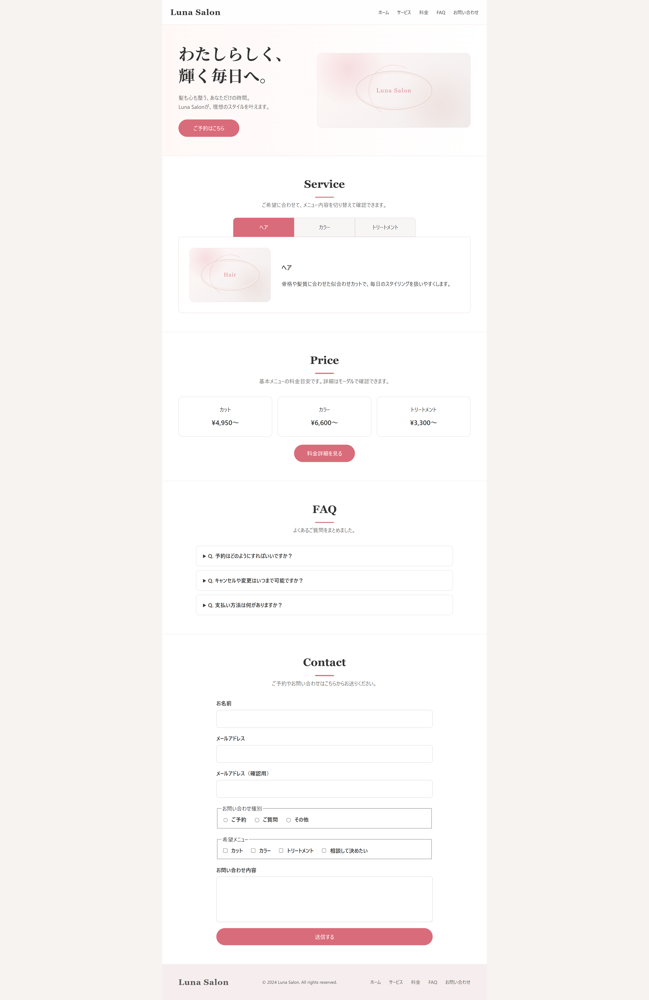
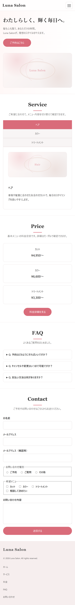

# 美容サロンLP風 JavaScript UIデモ

架空の美容サロン「Luna Salon」のランディングページを題材に、  
実際のWebサイトで使われやすいUI機能をJavaScriptで実装したデモページです。

既存Webサイトへの動きの追加や、操作性を改善する小規模なJavaScript改修を想定して制作しました。

## 概要

美容サロンのサービス紹介・料金案内・FAQ・お問い合わせフォームを配置した、1ページ構成のデモサイトです。

以下のUI機能を実装しています。

- ハンバーガーメニュー
- タブ切り替え
- 料金詳細モーダル
- お問い合わせフォームのバリデーション
- 送信完了を想定した確認モーダル
- ページトップへ戻るボタン

FAQにはHTML標準の `details` / `summary` 要素を使用しています。

すべての動きをJavaScriptで実装するのではなく、HTMLだけで対応できる機能とJavaScriptが必要な機能を分け、用途に合った実装方法を選ぶことを意識しました。

## 制作背景

Webサイトの改修案件では、ページ全体を新しく制作するだけでなく、以下のような依頼も多いと考えています。

- スマートフォン用メニューを追加したい
- サービス内容をタブで切り替えたい
- 詳細情報をモーダルで表示したい
- フォームの入力内容をチェックしたい
- ページが長いため、トップへ戻るボタンを追加したい

こうしたWebサイトでよく使われるUI機能を、1つのページ内でまとめて確認できる実装デモとして制作しました。

## 想定する対応例

- 既存サイトへのハンバーガーメニュー追加
- タブ切り替え機能の追加
- モーダル表示の追加
- フォームの入力チェック追加
- エラーメッセージ表示の改善
- ページトップへ戻るボタンの追加
- スマートフォン表示への対応
- HTML・CSS・JavaScriptを使った軽微な表示修正

## 使用技術

- HTML5
- CSS3
- JavaScript
- Git
- GitHub
- GitHub Pages

外部ライブラリやフレームワークは使用せず、HTML・CSS・JavaScriptのみで実装しています。

## 主な機能

### ハンバーガーメニュー

スマートフォン表示では、ボタン操作によってナビゲーションメニューを開閉できます。

以下の操作にも対応しています。

- メニューボタンによる開閉
- ナビゲーションリンク選択後の自動閉鎖
- メニュー外をクリックしたときの閉鎖
- `Escape` キーによる閉鎖
- 開閉状態に応じた `aria-expanded` と `aria-label` の更新

### タブ切り替え

サービス内容を「ヘア」「カラー」「トリートメント」の3種類に分け、選択した内容へ切り替えられるようにしました。

マウス操作だけでなく、以下のキーボード操作にも対応しています。

- 左右矢印キーによる移動
- `Home` キーで最初のタブへ移動
- `End` キーで最後のタブへ移動
- 選択中のタブへのフォーカス移動

`role="tab"`、`role="tabpanel"`、`aria-selected`、`aria-controls` などを使用し、タブと表示内容の関係が伝わる構造にしています。

### 料金詳細モーダル

「料金詳細を見る」ボタンを押すと、メニューごとの料金一覧をモーダルで表示します。

HTML標準の `dialog` 要素と `showModal()` を使用しています。

以下の操作に対応しています。

- 開くボタンによる表示
- 閉じるボタンによる非表示
- モーダル外側のクリックによる非表示
- 閉じた後、開くボタンへフォーカスを戻す処理

### フォームバリデーション

お問い合わせフォームでは、送信前に入力内容をJavaScriptで確認します。

チェック内容は以下のとおりです。

- 名前が入力されているか
- メールアドレスが入力されているか
- メールアドレスの形式が正しいか
- 確認用メールアドレスと一致しているか
- お問い合わせ種別が選択されているか
- 希望メニューが1つ以上選択されているか
- お問い合わせ内容が入力されているか
- お問い合わせ内容が10文字以上か

エラーがある場合は項目ごとにメッセージを表示し、最初にエラーとなった入力欄へフォーカスを移動します。

また、入力内容を修正した際には、条件を満たしたエラー表示を解除します。

### 送信完了モーダル

すべての入力チェックを通過すると、送信処理を想定した確認モーダルを表示します。

モーダル内には以下の内容を表示します。

- 名前
- メールアドレス
- お問い合わせ種別
- 希望メニュー

このページはデモのため、実際のメール送信やデータ送信は行っていません。

### FAQ

FAQにはHTML標準の `details` / `summary` 要素を使用しています。

JavaScriptを追加しなくても開閉機能を実装できるため、必要以上に処理を増やさず、HTMLの標準機能を活用しました。

### ページトップへ戻るボタン

ページを一定量スクロールすると、画面右下にトップへ戻るボタンを表示します。

ボタンを押すと、ページ上部まで滑らかにスクロールします。

スクロールイベント内では `requestAnimationFrame()` を使用し、連続して処理が実行されすぎないようにしています。

## 工夫した点

### 1. 実際のWebサイトを想定した構成

UIパーツを単体で並べるのではなく、美容サロンのLPという共通の題材に組み込みました。

各機能がどのような場面で使われるのか、ページを操作しながら確認できる構成にしています。

### 2. HTML標準機能との使い分け

FAQは `details` / `summary`、モーダルは `dialog` 要素を使用しました。

JavaScriptだけに頼らず、HTMLで対応できる部分はHTMLの機能を活用しています。

### 3. キーボード操作への対応

タブ切り替え、モーダル、ハンバーガーメニューでは、マウス操作以外の利用も想定しました。

フォーカス移動や `Escape` キー操作などを追加し、操作後にフォーカスが不自然な位置へ残らないようにしています。

### 4. エラー箇所を把握しやすいフォーム

フォーム送信時にすべての入力内容を確認し、最初のエラー項目へフォーカスを移動します。

さらに、入力を修正して条件を満たした場合は、その項目のエラー表示を解除するようにしました。

### 5. PC・スマートフォンへの対応

CSSのメディアクエリを使用し、画面幅に応じてレイアウトを変更しています。

スマートフォンでは以下のように表示を調整しています。

- ナビゲーションをハンバーガーメニューへ変更
- ヒーローエリアを1列表示へ変更
- タブボタンを縦並びへ変更
- 料金カードを縦並びへ変更
- フッターを縦方向へ変更
- モーダルの幅と余白を調整

## アクセシビリティへの配慮

以下の対応を行っています。

- 本文へ移動できるスキップリンク
- `aria-expanded` を使ったメニュー開閉状態の通知
- `aria-controls` を使った操作対象との関連付け
- タブの `aria-selected` と `tabindex` の切り替え
- モーダルの見出しと説明文の関連付け
- 入力エラー時の `aria-invalid`
- エラーメッセージへの `role="alert"`
- キーボードフォーカスの視認性向上
- 装飾画像への `aria-hidden="true"`

## 画面イメージ

### PC表示

### スマートフォン表示

## デモページ

[GitHub Pagesでデモを見る](https://kei-daido.github.io/javascript-ui-parts-demo/)

## リポジトリ

[GitHubリポジトリを見る](https://github.com/kei-daido/javascript-ui-parts-demo)

## 今後の改善予定

- フォーム送信処理との連携
- モーダル共通処理の関数化
- モジュール的な関数分割
- テストコードの追加
- 実際の画像素材を使用した表示改善
- より多様な画面幅での表示確認

## 補足

本作品はJavaScriptによるUI実装を確認するためのデモページです。

架空の美容サロンを題材としており、実在する店舗・サービスとは関係ありません。
